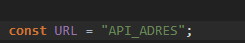

# Javascript Api ile reklam çekme

Javascript ile belirledğiniz bir apiden verileri alır ve popup şeklinde size sunar. Api ile popup resmini, açıklamasını ve popup'a tıklanınıca nereye gideceğini belirleyebiliyorsunuz. Ayrıca bunların hepsini sadece tek bir js dosyası ile yaptığımız için herhangi bir websitesine eklememiz kolaylaşıyor.

# Advertising with Javascript API

It takes the data from an api you specify with Javascript and presents it to you in the form of a popup. With the API, you can determine the popup image, description and where the popup will go when clicked. In addition, since we do all of these with only one js file, it becomes easier for us to add it to any website.

 
 

# Özellikleri

- Apiden her reklam category numarası belirliyoruz. Bunun sayesinde hangi reklama tıklarsa bundan sonra o kategoriye ait reklamları çıkartıyor. (Tarayıcıyı kapatıp açtıktan sonra çerez olarak kaydedilen kategeori siliniyor.)
- Kullanıcı reklama 10sn içerisinde tekrardan tıklamazsa reklam değişiyor.
- Sadece tek bir js dosyası ile yaptığımız için herhangi bir websitesine eklememiz kolaylaşıyor.
- Apiden data gelmezse reklma popup'ı gözükmüyor. (Görüntü kirliliği oluşmuyor)

# Properties

- We determine each ad category number from the API. Thanks to this, whichever ad he clicks on, it removes the ads belonging to that category from now on. (After closing and reopening the browser, the category saved as a cookie is deleted.)
- If the user does not click on the ad again within 10 seconds, the ad changes.
- Since we only do it with a single js file, it becomes easier for us to add it to any website.
- If no data is received from the API, the ad popup does not appear. (No image pollution occurs)

 
 

## Örnek bir data (An example data)

        var data = [
            {
                offer_imgurl: "image-url",
                offer_description: "test",
                offer_url: "url",
                category: "1",
            },
            {
                offer_imgurl: "image-url",
                offer_description: "test",
                offer_url: "url",
                category: "2",
            },
        ];

## Api adresi girilecek yer

# Will you buy me a coffee?

## [Patreon](https://www.patreon.com/keremgunes)
